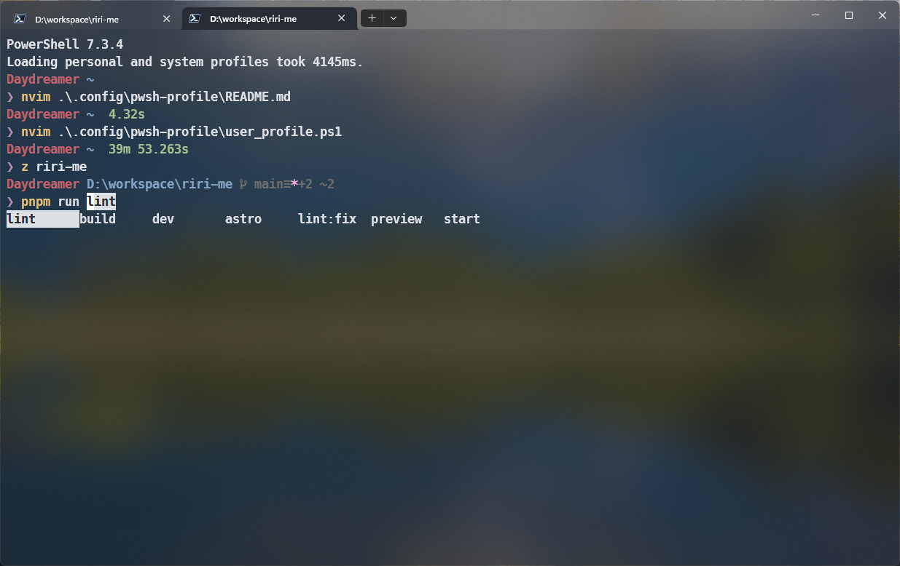

I shared [my PowerShell profile](https://github.com/Daydreamer-riri/pwsh-profile/) on GitHub.

It is ready to use out of the box, just clone it to `~/.config/`, and use a few commands to make it work.

It has the following features:

- Support path completion based on `PSReadLine`, and support command completion for pnpm, winget, and git.
- Beautiful shell powered by Oh My Posh.
- Short aliases to better use @antfu/ni.
- `z` for path jump; `Terminal-Icons` makes `ls` clear at a glance.

You can follow the [README](https://github.com/Daydreamer-riri/pwsh-profile/#readme) to use this profile.

#### preview

