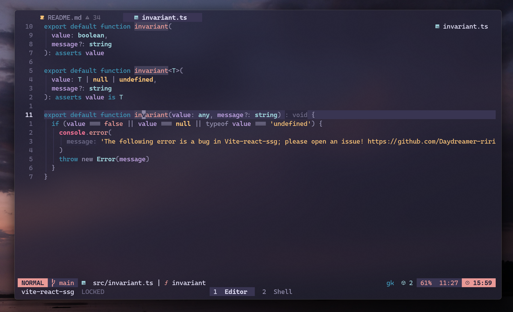

更新于 2025 年 1 月 27 日。

春节假期，昨天匆匆回到洛阳。现在的我坐在家里的餐桌前，写下这些文字。
这一年少有时间可以让我感受到与现在相同的安静与安心。

## 碎碎念

距离上次更新 now 已经过去快一年了。这一整个 2024 年，我几乎没怎么更新自己的博客。
工作忙碌，生活也同样忙碌。然而，对我个人而言，却似乎没有获得什么实质性的提升，感觉还挺 “瞎忙” 的。

**对我来说，这是有些迷茫的一年。**

## Neovim

若要说这一年里最让我有成就感的事情，那便是拥抱了命令行生态以及 Neovim 的世界。
我拥有了属于我自己的，令我满意的终端、命令行工具、Neovim 配置。每天在其中工作，即使是重复又枯燥的业务开发也可以带给我开心的感觉。

Neovim、zellij、lazygit…… 每一个工具都给我带来了意想不到的惊喜。先不说它们能在多大程度上提升开发效率，单是使用它们的过程，就为我带来了诸多乐趣。

倘若你对 “代码编辑” 这件事感到厌倦了，那就尝试一下 Neovim 吧！它一定能给你带来许多新鲜感。

## 对 2025 的期望

虽说我的 2024 年并没有太多值得提及之处，但这一年里，我更多地思考了自己想要成为什么样的人，以及自己真正想要的是什么。

过去两年，我几乎放弃了生活。并不是因为工作繁忙，而是因为种种原因一直没有去做我真正想做的事情。

新的一年我希望我可以：

- 每天读书并摘抄，做到一到两个月可以读完一本书
- 对博客的分享更加频繁一点，无论是技术上的还是生活上的（now）
- 一周一到两次跑步，剑指马拉松（尽量
- 完成一直想做却未做的开源贡献

## 尾巴

愿 2025，心愿皆成。
